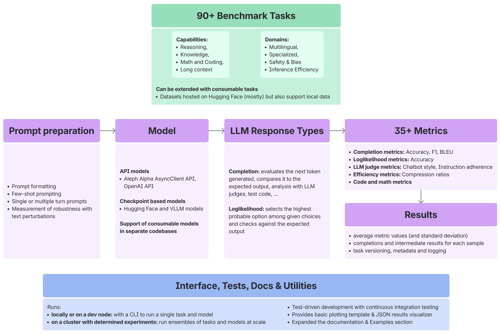
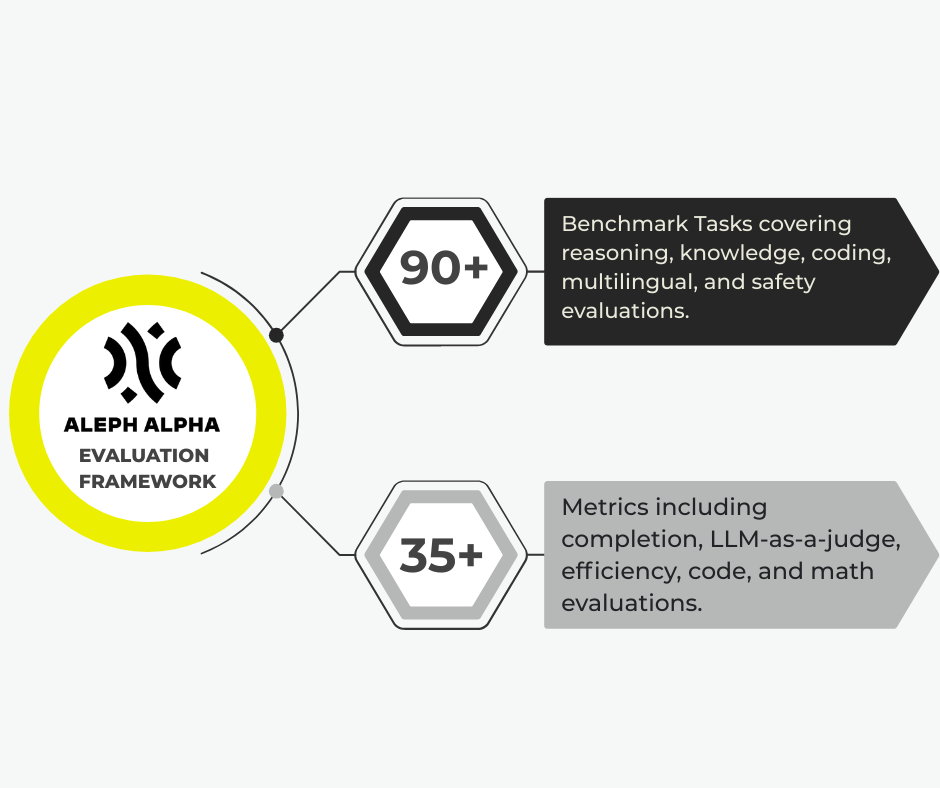
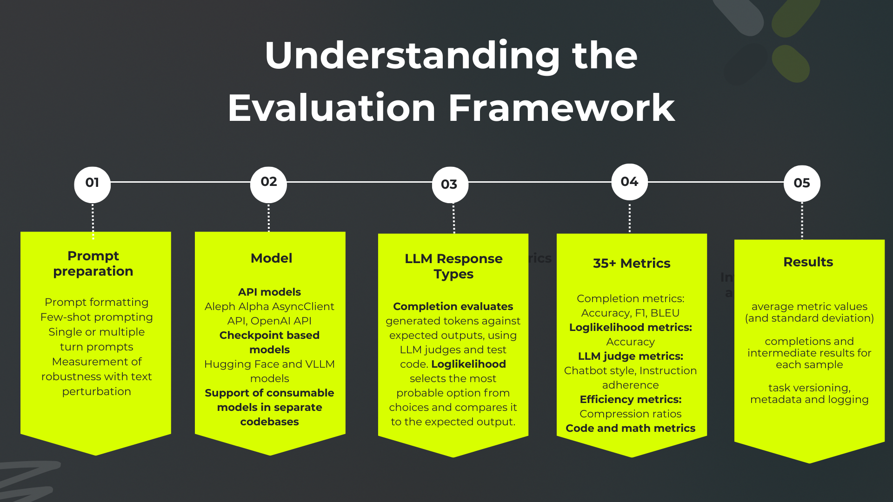

# Aleph Alpha Eval-Framework


> **Comprehensive LLM evaluation at scale** - A production-ready framework for evaluating large language models across 90+ benchmarks. It is designed for both rapid experimentation and large-scale, reproducible research.

<!---  --->


Why Choose This Framework?
- **Scalability**: Built for distributed evaluation using an integration with Determined AI.
- **Extensibility**: Easily add custom models, benchmarks, and metrics with object-oriented base classes.
- **Comprehensive**: Comes pre-loaded with over 150 tasks covering everything from reasoning and coding to safety and long-context.
- **Robust Analysis**: Built-in support for perturbation testing, statistical significance, and LLM-as-a-judge evaluations.

## Quick Start

### Installation
First, ensure you have **Python 3.12+**, **Poetry**, and the necessary **CUDA drivers** installed for GPU support.

Clone this repository and install via [poetry](https://python-poetry.org/docs/):

**Option 1: Using conda environment (recommended)**
```bash
conda create -n eval-framework python=3.12
conda activate eval-framework
conda install conda-forge::poetry
poetry install --all-extras
poetry run pip install --no-build-isolation flash-attn==2.7.2.post1
```

**Option 2: Using system-wide poetry**
```bash
curl -sSL https://install.python-poetry.org | python3 -
poetry install --all-extras
poetry run pip install --no-build-isolation flash-attn==2.7.2.post1
```

After installation, task documentation can be generated with `poetry run python utils/generate-task-docs.py` (see [docs/installation.md(docs/installation.md)) for more details.

### Run Your First Evaluation
Run a simple evaluation on the GSM8K benchmark using a small, pre-configured open-source model directly from the command line.

```bash
poetry run eval_framework \
    --models src/eval_framework/llm/models.py \
    --llm-name Llama31_8B_Instruct_HF \
    --task-name "GSM8K" \
    --output-dir ./eval \
    --num-fewshot 5 \
    --num-samples 10
```
For more detailed CLI usage instructions, see the [CLI Usage Guide](docs/cli_usage.md).

### Review Results
The output will be saved in the `./eval/` directory. Our [results guide](docs/understanding_results_guide.md) has details for how to interpret them.

### Advanced Usage

While the CLI is great for quick runs, the Python interface offers maximum flexibility. Here is how you can run an evaluation using a HuggingFace model:

```python
 from pathlib import Path

 from eval_framework.llm.huggingface_llm import HFLLM
 from eval_framework.main import main
 from eval_framework.tasks.eval_config import EvalConfig
 from template_formatting.formatter import HFFormatter

 # Define your model
 class MyHuggingFaceModel(HFLLM):
     LLM_NAME = "microsoft/DialoGPT-medium"
     DEFAULT_FORMATTER = HFFormatter("microsoft/DialoGPT-medium")

 if __name__ == "__main__":
     # Initialize your model
     llm = MyHuggingFaceModel()

     # Running evaluation on GSM8K task using 5 few-shot examples and 10 samples
     config = EvalConfig(
         output_dir=Path("./eval_results"),
         num_fewshot=5,
         num_samples=10,
         task_name="GSM8K",
         llm_class=MyHuggingFaceModel,
     )

     # Run evaluation and get results
     results = main(llm=llm, config=config)
```

#### How to choose between local and cluster execution

| Local Prototyping | Cluster Execution |
| :--- | :--- |
| **Run Method:** Execute single tasks on a dev node with the CLI. | **Run Method:** Run ensembles of tasks and models with Determined experiments. |
| **Ideal to:** Rapidly test, debug, and develop new custom benchmarks or models. | **Use Case:** Perform large-scale, reproducible evaluations for research or pre-production testing. |
| **Tools:** Includes a JSON visualizer and plotting templates for immediate feedback. | **Tools:** Leverages distributed computing to run many evaluations in parallel efficiently. |

### Next Steps

- **Use CLI interface**: See [CLI usage guide](docs/cli_usage.md) for command-line evaluation options
- **Evaluate HuggingFace models**: Follow our [HuggingFace evaluation guide](docs/evaluate_huggingface_model.md)
- **Create custom benchmarks**: Follow our [benchmark creation guide](docs/add_new_benchmark_guide.md)
- **Scale your evaluations**: Use [Determined AI integration](docs/using_determined.md) for distributed evaluation
- **Understand your results**: Read our [results interpretation guide](docs/understanding_results_guide.md)

## Features

- 90+ Benchmarks: Covers reasoning, knowledge, coding, long-context, and safety tasks.
- Custom Benchmarks: Easily add new benchmarks with minimal code using the BaseTask class.
- Distributed Evaluation: Integration with Determined AI for scalable distributed evaluation.
- Docker Support: Pre-configured Dockerfiles for local and distributed setups.
- Flexible Model Integration: Supports models loaded via HuggingFace Transformers or custom implementations using the BaseLLM class.
- Custom Metrics: Easily define new metrics using the BaseMetric class.
- Rich Outputs: Generates JSON results, plots, and detailed analysis reports.
- Perturbation Testing: Robustness analysis with configurable perturbation types and probabilities.
- Statistical Analysis: Includes confidence intervals and significance testing for reliable comparisons.
- LLM-as-a-Judge: Evaluation using LLM judges.


## Benchmark Coverage & Task Categories

### Core Capabilities

| **Reasoning** | **Knowledge** | **Coding** | **Long Context** |
|---------------|---------------|------------|------------------|
| MMLU (57 subjects) | TriviaQA | HumanEval | InfiniteBench |
| SQuAD v1/v2 | MBPP |
| ARC | Natural Questions | CodeT5 | ZeroSCROLLS |
| HellaSwag | QuAC | Programming | QuALITY |
| Winogrande | COPA | Debugging  |

### Languages & Domains

| **Multilingual** | **Specialized** | **Safety & Bias** | **Efficiency** |
|------------------|-----------------|-------------------|----------------|
| WMT Translation | Legal (CaseHold) | TruthfulQA | Token counting |
| FLORES-200 | Winogender | Latency metrics |
| Multilingual MMLU | Medical (MedQA) | Stereotype detection | Memory usage |
| German/Finnish tasks | Scientific (SciQ) | Harmful content | Cost analysis |

### Completion
Tasks focused on logical reasoning, text distillation, instruction following, and output control. Examples include:
- **AIME 2024:** Logical Reasoning (Math)
- **DUC Abstractive:** Text Distillation (Extraction)
- **Custom Data: Complaint Summarization:** Text Distillation (Summarization)

### Loglikelihoods
Tasks emphasizing classification, reasoning, and open QA. Examples include:
- **Abstract Reasoning Challenge (ARC):** Classification
- **Casehold:** Open QA

### Long-Context
Tasks designed for long-context scenarios, including QA, summarization, and aggregation. Examples include:
- **InfiniteBench_CodeDebug:** Programming
- **ZeroSCROLLS GovReport:** QA (Government)

### Metrics
Evaluation metrics include:
- **Completion Metrics:** Accuracy, Bleu, F1, Rouge
- **Loglikelihood Metrics:** Accuracy Loglikelihood, Probability Mass
- **LLM Metrics:** Chatbot Style Judge, Instruction Judge
- **Efficiency Metrics:** Bytes per Sequence Position

For the full list of tasks and metrics, see [Detailed Task Table](docs/benchmarks_and_metrics.md).

## Understanding the Evaluation Framework



Eval-Framework provides a unified interface for evaluating language models across diverse benchmarks. The framework follows this interaction model:

1. **Define Your Model** - Specify which model to evaluate (HuggingFace, API, or custom)
2. **Choose Your Task** - Select from 90+ available benchmarks or create custom ones
3. **Configure Evaluation** - Set parameters like few-shot examples, sample count, and output format
4. **Run Evaluation** - Execute locally via CLI/script or distribute via Determined AI
5. **Analyze Results** - Review detailed JSON outputs, metrics, and generated reports

### Core Components

- **Models**: Defined via [`BaseLLM`](docs/evaluate_huggingface_model.md) interface (HuggingFace, OpenAI, custom APIs)
- **Tasks**: Inherit from [`BaseTask`](docs/add_new_benchmark_guide.md) (completion, loglikelihood, or LLM-judge based)
- **Metrics**: Automatic scoring via [`BaseMetric`](docs/benchmarks_and_metrics.md) classes
- **Formatters**: Handle prompt construction and model-specific formatting
- **Results**: Structured outputs with sample-level details and aggregated statistics

## Documentation

### Getting Started
- **[CLI Usage Guide](docs/cli_usage.md)** - Detailed instructions for using the command-line interface
- **[Evaluating HuggingFace Models](docs/evaluate_huggingface_model.md)** - Complete guide for evaluating HuggingFace models
- **[Understanding Results](docs/understanding_results_guide.md)** - How to read and interpret evaluation results

### Advanced Usage
- **[Adding New Benchmarks](docs/add_new_benchmark_guide.md)** - Complete guide with practical examples for adding new benchmarks
- **[Benchmarks and Metrics](docs/benchmarks_and_metrics.md)** - Comprehensive overview of all available benchmarks and evaluation metrics
- **[Overview of Dataloading](docs/overview_dataloading.md)** - Explanation of dataloading and task/sample/message structure

### Scaling & Production
- **[Using Determined](docs/using_determined.md)** - Guide for distributed evaluation using Determined AI
- **[Controlling Upload Results](docs/controlling_upload_results.md)** - How to manage and control the upload of evaluation results


### Citation

If you use Eval-Framework in your research, please cite:

```bibtex
@software{eval_framework,
  title={Eval Framework},
  year={2025},
  url={https://github.com/Aleph-Alpha-Research/eval-framework}
}
```

### License

This project is licensed under the [Apache License 2.0](LICENSE).

---
