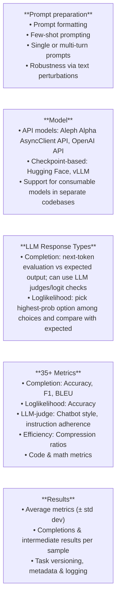

# Aleph Alpha Eval-Framework

> **Comprehensive LLM evaluation at scale** - A production-ready framework for evaluating large language models across 90+ benchmarks.

## Features

- 90+ Benchmarks: Covers reasoning, knowledge, coding, long-context, and safety tasks.
- Custom Benchmarks: Easily add new benchmarks with minimal code using the BaseTask class.
- Distributed Evaluation: Integration with Determined AI for scalable distributed evaluation.
- Docker Support: Pre-configured Dockerfiles for local and distributed setups.
- Flexible Model Integration: Supports models loaded via HuggingFace Transformers or custom implementations using the BaseLLM class.
- Custom Metrics: Easily define new metrics using the BaseMetric class.
- Rich Outputs: Generates JSON results, plots, and detailed analysis reports.
- Perturbation Testing: Robustness analysis with configurable perturbation types and probabilities.
- Statistical Analysis: Includes confidence intervals and significance testing for reliable comparisons.
- LLM-as-a-Judge: Evaluation using LLM judges.



## Benchmark Coverage & Task Categories

### Core Capabilities

| **Reasoning** | **Knowledge** | **Coding** | **Long Context** |
|---------------|---------------|------------|------------------|
| MMLU (57 subjects) | TriviaQA | HumanEval | InfiniteBench |
| SQuAD v1/v2 | MBPP |
| ARC | Natural Questions | CodeT5 | ZeroSCROLLS |
| HellaSwag | QuAC | Programming | QuALITY |
| Winogrande | COPA | Debugging  |

### Languages & Domains

| **Multilingual** | **Specialized** | **Safety & Bias** | **Efficiency** |
|------------------|-----------------|-------------------|----------------|
| WMT Translation | Legal (CaseHold) | TruthfulQA | Token counting |
| FLORES-200 | Winogender | Latency metrics |
| Multilingual MMLU | Medical (MedQA) | Stereotype detection | Memory usage |
| German/Finnish tasks | Scientific (SciQ) | Harmful content | Cost analysis |

### Completion

Tasks focused on logical reasoning, text distillation, instruction following, and output control. Examples include:
- **AIME 2024:** Logical Reasoning (Math)
- **DUC Abstractive:** Text Distillation (Extraction)
- **Custom Data: Complaint Summarization:** Text Distillation (Summarization)

### Loglikelihoods

Tasks emphasizing classification, reasoning, and open QA. Examples include:
- **Abstract Reasoning Challenge (ARC):** Classification
- **Casehold:** Open QA

### Long-Context

Tasks designed for long-context scenarios, including QA, summarization, and aggregation. Examples include:
- **InfiniteBench_CodeDebug:** Programming
- **ZeroSCROLLS GovReport:** QA (Government)

### Metrics

Evaluation metrics include:
- **Completion Metrics:** Accuracy, Bleu, F1, Rouge
- **Loglikelihood Metrics:** Accuracy Loglikelihood, Probability Mass
- **LLM Metrics:** Chatbot Style Judge, Instruction Judge
- **Efficiency Metrics:** Bytes per Sequence Position

For the full list of tasks and metrics, see [Detailed Task Table](docs/benchmarks_and_metrics.md).

## Understanding the Evaluation Framework

Eval-Framework provides a unified interface for evaluating language models across diverse benchmarks. The framework follows this interaction model:

1. **Define Your Model** - Specify which model to evaluate (HuggingFace, API, or custom)
2. **Choose Your Task** - Select from 150+ available benchmarks or create custom ones
3. **Configure Evaluation** - Set parameters like few-shot examples, sample count, and output format
4. **Run Evaluation** - Execute locally via CLI/script or distribute via Determined AI
5. **Analyze Results** - Review detailed JSON outputs, metrics, and generated reports

### Core Components

- **Models**: Defined via [`BaseLLM`](docs/evaluate_huggingface_model.md) interface (HuggingFace, OpenAI, custom APIs)
- **Tasks**: Inherit from [`BaseTask`](docs/add_new_benchmark_guide.md) (completion, loglikelihood, or LLM-judge based)
- **Metrics**: Automatic scoring via [`BaseMetric`](docs/benchmarks_and_metrics.md) classes
- **Formatters**: Handle prompt construction and model-specific formatting
- **Results**: Structured outputs with sample-level details and aggregated statistics

## Documentation

### Getting Started

- **[CLI Usage Guide](docs/cli_usage.md)** - Detailed instructions for using the command-line interface
- **[Evaluating HuggingFace Models](docs/evaluate_huggingface_model.md)** - Complete guide for evaluating HuggingFace models
- **[Understanding Results](docs/understanding_results_guide.md)** - How to read and interpret evaluation results

### Advanced Usage

- **[Adding New Benchmarks](docs/add_new_benchmark_guide.md)** - Complete guide with practical examples for adding new benchmarks
- **[Benchmarks and Metrics](docs/benchmarks_and_metrics.md)** - Comprehensive overview of all available benchmarks and evaluation metrics
- **[Overview of Dataloading](docs/overview_dataloading.md)** - Explanation of dataloading and task/sample/message structure

### Scaling & Production

- **[Using Determined](docs/using_determined.md)** - Guide for distributed evaluation using Determined AI
- **[Controlling Upload Results](docs/controlling_upload_results.md)** - How to manage and control the upload of evaluation results

### Citation

If you use `eval-framework` in your research, please cite:

```bibtex
@software{eval_framework,
  title={Aleph Alpha Eval Framework},
  year={2025},
  url={https://github.com/Aleph-Alpha-Research/eval-framework}
}
```

### License

This project is licensed under the [Apache License 2.0](LICENSE).

<br><br>
---

This project has received funding from the European Union’s Digital Europe Programme under grant agreement No. 101195233 (OpenEuroLLM).

The contents of this publication are the sole responsibility of the OpenEuroLLM consortium and do not necessarily reflect the opinion of the European Union.

<p align="center">
  
  
</p>
